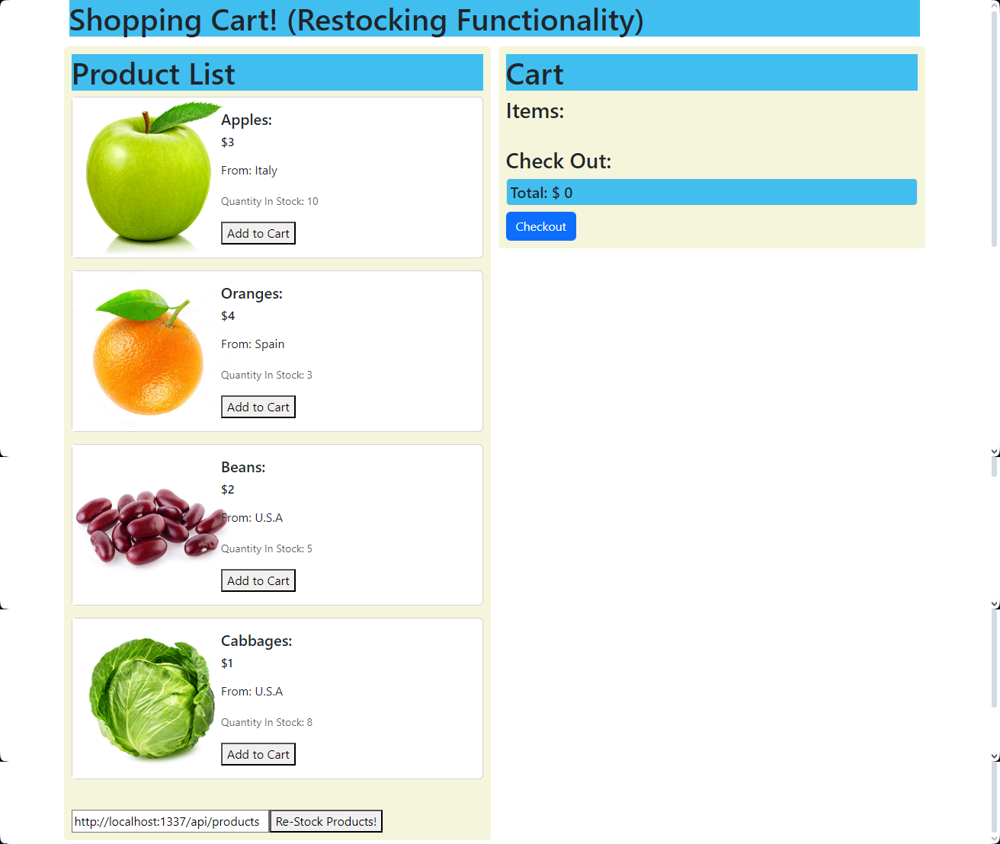

# Shopping Cart
## Description
This project is a simple React-based shopping cart application that includes functionality to add, remove, and restock products. The restocking feature is implemented by making API calls to a Strapi backend to fetch updated product data.

## Features
- Add to Cart: Users can add products to the shopping cart.
- Remove from Cart: Users can remove products from the shopping cart.
- Restock Products: Users can restock products by fetching fresh data from a Strapi API.

## Installation
1. Clone the repository: `git clone https://github.com/LucaBrizuela/react-shopping-cart.git`
2. Navigate to the project directory: `cd react-shopping-cart`
3. Install dependencies: `npm install`
4. Run the application: `npm start`

## Usage
1. Open your browser and go to `http://localhost:3000.`
2. Add products to your cart by clicking the "Add to Cart" button.
3. Remove products from your cart by clicking the "Remove from Cart" button.
4. To restock products, enter the Strapi API URL in the input field and click the "Re-Stock Products" button.

## Roadmap
### Version 2.0:

- Add user authentication to allow users to save their cart across sessions.
- Implement a payment gateway for the checkout process.
- Improve the UI/UX with better design and animations.
- Add unit and integration tests for better code coverage.

### Version 3.0:

- Integrate with more advanced backend services for dynamic stock management.
- Implement discount codes and promotions.
- Add a feature for users to leave reviews and ratings for products.

## License
This project is licensed under the MIT License. See the [LICENSE](https://github.com/LucaBrizuela/Shopping-Cart/blob/main/LICENSE) file for details.

## Results

